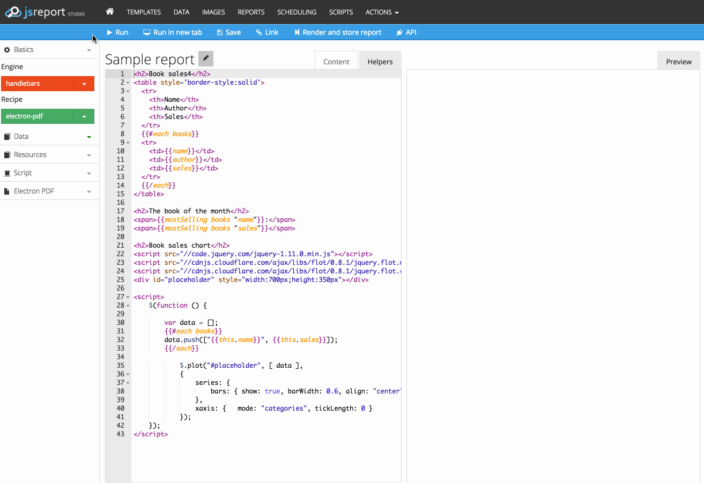

# @jsreport/jsreport-electron-pdf

[](https://npmjs.com/package/jsreport-electron-pdf)[](http://opensource.org/licenses/MIT)

> **jsreport recipe which renders pdf from html using electron**



Adds recipe `electron-pdf` to jsreport, which render pdf from html using electron.

`electron-pdf` recipe is capable of rendering any html and javascript you provide. This means you can also use external javascript libraries or canvas to print visual charts.

Installation
------------

> npm install @jsreport/jsreport-electron-pdf --save
> npm install electron --save

Linux servers requires to run jsreport with this recipe through xvfb. You can find an example how to do it [here](https://github.com/jsreport/jsreport/blob/master/docker/full/run.sh#L36). Note that `electron-pdf` is also included in the [jsreport full docker image](https://hub.docker.com/r/jsreport/jsreport/) which can simplify the installation on linux targets.

jsreport-core
-------------

If you use `jsreport-core`, you can apply this extension manually and [pass configuration](#configuration) to it directly:

```js
var jsreport = require('@jsreport/jsreport-core')();
jsreport.use(require('@jsreport/jsreport-electron-pdf')({ strategy: 'electron-ipc' }));
```

Configuration
-------------

Use `electron-pdf` key in the standard [jsreport config](https://github.com/jsreport/jsreport/blob/master/config.md) file.

Available options:

```js
"extensions": {
  "electron-pdf": {
    /* use rather dedicated process for every generation,
      dedicated-process strategy is quite slower but can solve some bugs
      with corporate proxy, set to 'electron-server' for maximum performance.

      possible values: 'dedicated-process', 'electron-ipc' or 'electron-server', defaults to 'dedicated-process' */
    "strategy": "electron-ipc",
    /* number of allocated electron processes (when using electron-server strategy) */
    "numberOfWorkers": 2,
    /* time in ms to wait for worker ping response in order to be considered alive when using `electron-server` or `electron-ipc` strategy */
    "pingTimeout": 100,
    /* timeout in ms for pdf generation, when the timeout is reached, the conversion is cancelled */
    "timeout": 5000,
    /* optional port range where to start electron server (when using electron-server strategy) */
    "portLeftBoundary": 1000,
    "portRightBoundary": 2000,
    /* optional hostname where to start electron server when using electron-server strategy) */
    "host": '127.0.0.1',
    /* optional chrome command line switches for electron process, see https://electron.atom.io/docs/api/chrome-command-line-switches/ for details. */
    "chromeComandLineSwitches": {
      'disable-http-cache': null
    },
    /* set to true to allow requests using the file protocol (file:///). defaults to false */
    "allowLocalFilesAccess": false,
    /* the collected console.log, console.error, console.warn messages are trimmed by default */
    "maxLogEntrySize": 1000
  }
}
```

Settings
--------

`electron-pdf` recipe uses [electron's printToPDF feature](http://electron.atom.io/docs/v0.36.1/api/web-contents/#webcontents-printtopdf-options-callback) to generate PDF from a web page, so basically most options are the same as electron's `printoToPDF` options.

Available settings for pdf generation:

-	`marginsType` Number - specify the type of margins to use in PDF.
	-	`0` - default
	-	`1` - none
	-	`2` - minimum
-	`landscape` Boolean - `true` for landscape, `false` for portrait.
-	`format` String - predefined page sizes or Object - { width, height } in microns.
	-	`A4`
	-	`A3`
	-	`Legal`
	-	`Letter`
	-	`Tabloid`
	- `Object|JSON Object String. Keys: width, height. Values: integer in microns (micrometers) (1/1000mm)`
		- e.g. A5: `"{ 'width': 148000, 'height': 210000 }"`
-	`printBackground` Boolean - whether to print CSS backgrounds or not.
-	`width` Number - width (`px`) of the web page (`BrowserWindow`) that would be used to generate the PDF.
-	`height` Number - height (`px`) of the web page (`BrowserWindow`) that would be used to generate the PDF.
-	`printDelay` Number - delay between rendering a page and printing into pdf, this is useful when printing animated content like charts, or you can use `waitForJS` option.
-	`blockJavaScript` Boolean - whether to disable javascript execution in page or not.
-	`waitForJS` Boolean - if it is set to `true` the PDF generation will wait until you set `window.JSREPORT_READY_TO_START` to true in your page.

Page breaks
-----------

Css contains styles like `page-break-before` you can use to specify html page breaks. This can be used as well with `electron-pdf` to specify page breaks inside pdf files.

```html
<h1>Hello from Page 1</h1>

<div style='page-break-before: always;'></div>

<h1>Hello from Page 2</h1>

<div style="page-break-before: always;"></div>

<h1>Hello from Page 3</h1>
```

Headers and footers
-------------------

Attach a header and footer to PDF is not currently supported :(, unlike `phantomjs`, `electron` does not provide a way to attach a header/footer to the final PDF.

Printing triggers
-----------------

You may need to postpone pdf printing until some javascript async tasks are processed. If this is your case set the `waitForJS: true` option in the API or `Wait for printing trigger` in the studio menu. Then the printing won't start until you set `window.JSREPORT_READY_TO_START=true` inside your template's javascript.

```html
...
<script>
    // do some calculations or something async
    setTimeout(function() {
        window.JSREPORT_READY_TO_START = true; // this will start the pdf printing
    }, 500);
    ...
</script>
```

Twitter Bootstrap
-----------------

Using a responsive css framework for printing pdf may not be the best idea. However it still works. Only thing you need to keep in mind is that output pdf typically won't look the same as html because bootstrap includes different printing styles under `@media print`.

Troubleshooting
---------------

#### Using electron in single core machines

If you are using a machine with a single-core processor you will probably experience a high CPU usage when doing any rendering (97% in most cases and the usage is worse when using Windows), this is because a limitation in electron when it is being used on single core machines, unfortunately the only way to overcome this is to upgrade your machine to a processor with more cores (a processor with two cores is fine).
more info: [issue1](https://github.com/Microsoft/vscode/issues/17097), [issue2](https://github.com/Microsoft/vscode/issues/22724)

See [`electron-html-to` for more troubleshooting](https://github.com/bjrmatos/electron-html-to#troubleshooting)

License
-------

See [license](https://github.com/bjrmatos/jsreport-electron-pdf/blob/master/LICENSE)
